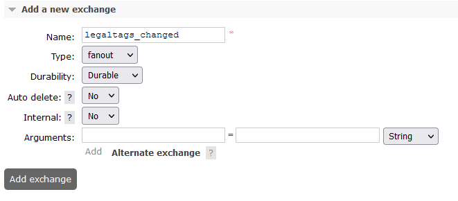

## Service Configuration for Baremetal

## Environment variables

Define the following environment variables.

Must have:

| name                                      | value         | description                                                                                                                                                                                                                                                                                                | sensitive? | source |
|-------------------------------------------|---------------|------------------------------------------------------------------------------------------------------------------------------------------------------------------------------------------------------------------------------------------------------------------------------------------------------------|------------|--------|
| `SPRING_PROFILES_ACTIVE`                  | ex `anthos`   | Spring profile that activate default configuration for Google Cloud environment                                                                                                                                                                                                                            | false      | -      |
| `SHARED_TENANT_NAME`                      | ex `anthos`   | Shared account id                                                                                                                                                                                                                                                                                          | no         | -      |
| `<POSTGRES_PASSWORD_ENV_VARIABLE_NAME>`   | ex `password` | Potgres user, name of that variable not defined at the service level, the name will be received through partition service. Each tenant can have it's own ENV name value, and it must be present in ENV of Indexer service, see [Partition properties set](#properties-set-in-partition-service)            | yes        | -      |
| `<SEAWEEDFS_ACCESS_KEY_ENV_VARIABLE_NAME>`| ex `password` | SeaweedFS password, name of that variable not defined at the service level, the name will be received through partition service. Each tenant can have it's own ENV name value, and it must be present in ENV of Indexer service, see [Partition properties set](#properties-set-in-partition-service)      | yes        | -      |
| `<AMQP_PASSWORD_ENV_VARIABLE_NAME>`       | ex `password` | RabbitMQ password, name of that variable not defined at the service level, the name will be received through partition service. Each tenant can have it's own ENV name value, and it must be present in ENV of Indexer service, see [Partition properties set](#properties-set-in-partition-service)       | yes        | -      |
| `<AMQP_ADMIN_PASSWORD_ENV_VARIABLE_NAME>` | ex `password` | RabbitMQ Admin password, name of that variable not defined at the service level, the name will be received through partition service. Each tenant can have it's own ENV name value, and it must be present in ENV of Indexer service, see [Partition properties set](#properties-set-in-partition-service) | yes        | -      |

Defined in default application property file but possible to override:

| name                                             | value                                         | description                                                             | sensitive? | source                                                       |
|--------------------------------------------------|-----------------------------------------------|-------------------------------------------------------------------------|------------|--------------------------------------------------------------|
| `LOG_PREFIX`                                     | `schema`                                      | Logging prefix                                                          | no         | -                                                            |
| `LOG_LEVEL`                                      | `DEBUG`                                       | Logging level                                                           | no         | -                                                            |
| `SERVER_SERVLET_CONTEXPATH`                      | `/api/schema-service/v1`                      | Servlet context path                                                    | no         | -                                                            |
| `AUTHORIZE_API`                                  | ex `https://entitlements.com/entitlements/v1` | Entitlements API endpoint                                               | no         | output of infrastructure deployment                          |
| `PARTITION_API`                                  | ex `http://localhost:8081/api/partition/v1`   | Partition service endpoint                                              | no         | -                                                            |
| `GOOGLE_APPLICATION_CREDENTIALS`                 | ex `/path/to/directory/service-key.json`      | Service account credentials, you only need this if running locally      | yes        | <https://console.cloud.google.com/iam-admin/serviceaccounts> |
| `SCHEMA_CHANGED_MESSAGING_ENABLED`               | `true` OR `false`                             | Allows to configure message publishing about schemas changes to Pub/Sub | no         | -                                                            |
| `SCHEMA_CHANGED_TOPIC_NAME`                      | `schema-changed`                              | Topic for schema changes events                                         | no         | -                                                            |
| `PARTITION_PROPERTIES_SCHEMA_BUCKET_NAME`        | ex `schema.bucket.name`                       | name of partition property for schema bucket name value                 | yes        | -                                                            |
| `PARTITION_PROPERTIES_SYSTEM_SCHEMA_BUCKET_NAME` | ex `system.schema.bucket.name`                | name of partition property for system schema bucket name value          | yes        | -                                                            |
| `MANAGEMENT_ENDPOINTS_WEB_BASE`                  | ex `/`                                        | Web base for Actuator                                                   | no         | -                                                            |
| `MANAGEMENT_SERVER_PORT`                         | ex `8081`                                     | Port for Actuator                                                       | no         | -                                                            |

These variables define service behavior, and are used to switch between `reference` or `Google Cloud` environments, their overriding
and usage in mixed mode was not tested. Usage of spring profiles is preferred.

| name                     | value                     | description                                                                                                               | sensitive? | source |
|--------------------------|---------------------------|---------------------------------------------------------------------------------------------------------------------------|------------|--------|
| `PARTITION_AUTH_ENABLED` | ex `true` or `false`      | Disable or enable auth token provisioning for requests to Partition service                                               | no         | -      |

## Partition level config

### Non-sensitive partition properties
| name                                        | value                          | description                          | sensitive? | source                                           |
|---------------------------------------------|--------------------------------|--------------------------------------|------------|--------------------------------------------------|
| `<SCHEMA_BUCKET_NAME_PROPERTY_NAME>`        | ex `schema.bucket.name`        | schema address in OBM storage        | no         | `PARTITION_PROPERTIES_SCHEMA_BUCKET_NAME`        |
| `<SYSTEM_SCHEMA_BUCKET_NAME_PROPERTY_NAME>` | ex `system.schema.bucket.name` | system schema address in OBM storage | no         | `PARTITION_PROPERTIES_SYSTEM_SCHEMA_BUCKET_NAME` |

## Testing

### Running E2E Tests

This section describes how to run cloud OSDU E2E tests (testing/schema-test-core).

You will need to have the following environment variables defined.

| name                                 | value                                   | description                               | sensitive?                              | source |
|--------------------------------------|-----------------------------------------|-------------------------------------------|-----------------------------------------|--------|
| `VENDOR`                             | `anthos`                                | Use value 'gcp' to run Google Cloud tests | no                                      | -      |
| `HOST`                               | ex`http://localhost:8080`               | Schema service host                       | no                                      | -      |
| `PRIVATE_TENANT2`                    | ex`opendes`                             | OSDU tenant used for testing              | no                                      | -      |
| `PRIVATE_TENANT1`                    | ex`osdu`                                | OSDU tenant used for testing              | no                                      | -      |
| `SHARED_TENANT`                      | ex`common`                              | OSDU tenant used for testing              | no                                      | -      |
| `TEST_OPENID_PROVIDER_CLIENT_ID`     | `********`                              | Client Id for `$INTEGRATION_TESTER`       | yes                                     | --     |
| `TEST_OPENID_PROVIDER_CLIENT_SECRET` | `********`                              |                                           | Client secret for `$INTEGRATION_TESTER` | --     |
| `TEST_OPENID_PROVIDER_URL`           | `https://keycloak.com/auth/realms/osdu` | OpenID provider url                       | yes                                     | --     |

**Entitlements configuration for integration accounts**

| INTEGRATION_TESTER                                                                                                                                                                         |
|--------------------------------------------------------------------------------------------------------------------------------------------------------------------------------------------|
| users<br/>service.schema-service.system-admin<br/>service.entitlements.user<br/>service.schema-service.viewers<br/>service.schema-service.editors<br/>data.integration.test<br/>data.test1 |

Execute following command to build code and run all the integration tests:

 ```bash
 # Note: this assumes that the environment variables for integration tests as outlined
 #       above are already exported in your environment.
 # build + install integration test core
 $ (cd testing/schema-test-core/ && mvn clean test)
 ```

### Properties set in Partition service

Note that properties can be set in Partition as `sensitive` in that case in property `value` should be present not value itself, but ENV variable name.
This variable should be present in environment of service that need that variable.

Example:

```
    "elasticsearch.port": {
      "sensitive": false, <- value not sensitive 
      "value": "9243"  <- will be used as is.
    },
      "elasticsearch.password": {
      "sensitive": true, <- value is sensitive 
      "value": "ELASTIC_SEARCH_PASSWORD_OSDU" <- service consumer should have env variable ELASTIC_SEARCH_PASSWORD_OSDU with elastic search password
    }
```

## Postgres configuration

### Properties set in Partition service

**prefix:** `osm.postgres`

It can be overridden by:

- through the Spring Boot property `osm.postgres.partition-properties-prefix`
- environment variable `OSM_POSTGRES_PARTITION_PROPERTIES_PREFIX`

**Propertyset:**

| Property                         | Description |
|----------------------------------|-------------|
| osm.postgres.datasource.url      | server URL  |
| osm.postgres.datasource.username | username    |
| osm.postgres.datasource.password | password    |

<details><summary>Example of a definition for a single tenant</summary>

```

curl -L -X PATCH 'http://partition.com/api/partition/v1/partitions/opendes' -H 'data-partition-id: opendes' -H 'Authorization: Bearer ...' -H 'Content-Type: application/json' --data-raw '{
  "properties": {
    "osm.postgres.datasource.url": {
      "sensitive": false,
      "value": "jdbc:postgresql://127.0.0.1:5432/postgres"
    },
    "osm.postgres.datasource.username": {
      "sensitive": false,
      "value": "postgres"
    },
    "osm.postgres.datasource.password": {
      "sensitive": true,
     "value": "<POSTGRES_PASSWORD_ENV_VARIABLE_NAME>" <- (Not actual value, just name of env variable)
    }
  }
}'

```

</details>

### Schema configuration

```
CREATE SCHEMA IF NOT EXISTS dataecosystem AUTHORIZATION <SCHEMA_POSTGRESQL_USERNAME>;
```

For private tenants:

```
-- Table: <data-partition-id>.authority
-- DROP TABLE IF EXISTS <data-partition-id>.authority;
CREATE TABLE IF NOT EXISTS <data-partition-id>.authority
(
    id text COLLATE pg_catalog."default" NOT NULL,
    pk bigint NOT NULL GENERATED ALWAYS AS IDENTITY ( INCREMENT 1 START 1 MINVALUE 1 MAXVALUE 9223372036854775807 CACHE 1 ),
    data jsonb NOT NULL,
    CONSTRAINT "Authority_pkey" PRIMARY KEY (pk),
    CONSTRAINT authority_id UNIQUE (id)
)
TABLESPACE pg_default;
ALTER TABLE IF EXISTS <data-partition-id>.authority
    OWNER to <SCHEMA_POSTGRESQL_USERNAME>;
-- Index: authority_datagin
-- DROP INDEX IF EXISTS <data-partition-id>.authority_datagin;
CREATE INDEX IF NOT EXISTS authority_datagin
    ON <data-partition-id>.authority USING gin
    (data)
    TABLESPACE pg_default;
-- Table: <data-partition-id>.entityType
-- DROP TABLE IF EXISTS <data-partition-id>."entityType";
CREATE TABLE IF NOT EXISTS <data-partition-id>."entityType"
(
    id text COLLATE pg_catalog."default" NOT NULL,
    pk bigint NOT NULL GENERATED ALWAYS AS IDENTITY ( INCREMENT 1 START 1 MINVALUE 1 MAXVALUE 9223372036854775807 CACHE 1 ),
    data jsonb NOT NULL,
    CONSTRAINT "EntityType_pkey" PRIMARY KEY (pk),
    CONSTRAINT entitytype_id UNIQUE (id)
)
TABLESPACE pg_default;
ALTER TABLE IF EXISTS <data-partition-id>."entityType"
    OWNER to <SCHEMA_POSTGRESQL_USERNAME>;
-- Index: entitytype_datagin
-- DROP INDEX IF EXISTS <data-partition-id>.entitytype_datagin;
CREATE INDEX IF NOT EXISTS entitytype_datagin
    ON <data-partition-id>."entityType" USING gin
    (data)
    TABLESPACE pg_default;
    -- Table: <data-partition-id>.schema_osm
-- DROP TABLE IF EXISTS <data-partition-id>."schema_osm";
CREATE TABLE IF NOT EXISTS <data-partition-id>."schema_osm"
(
    id text COLLATE pg_catalog."default" NOT NULL,
    pk bigint NOT NULL GENERATED ALWAYS AS IDENTITY ( INCREMENT 1 START 1 MINVALUE 1 MAXVALUE 9223372036854775807 CACHE 1 ),
    data jsonb NOT NULL,
    CONSTRAINT "Schema_pkey" PRIMARY KEY (pk),
    CONSTRAINT schemarequest_id UNIQUE (id)
)
TABLESPACE pg_default;
ALTER TABLE IF EXISTS <data-partition-id>."schema_osm"
    OWNER to <SCHEMA_POSTGRESQL_USERNAME>;
-- Index: schemarequest_datagin
-- DROP INDEX IF EXISTS dataecosystem.schemarequest_datagin;
CREATE INDEX IF NOT EXISTS schemarequest_datagin
    ON <data-partition-id>."schema_osm" USING gin
    (data)
    TABLESPACE pg_default;
    -- Table: <data-partition-id>.source
-- DROP TABLE IF EXISTS <data-partition-id>.source;
CREATE TABLE IF NOT EXISTS <data-partition-id>.source
(
    id text COLLATE pg_catalog."default" NOT NULL,
    pk bigint NOT NULL GENERATED ALWAYS AS IDENTITY ( INCREMENT 1 START 1 MINVALUE 1 MAXVALUE 9223372036854775807 CACHE 1 ),
    data jsonb NOT NULL,
    CONSTRAINT "Source_pkey" PRIMARY KEY (pk),
    CONSTRAINT source_id UNIQUE (id)
)
TABLESPACE pg_default;
ALTER TABLE IF EXISTS <data-partition-id>.source
    OWNER to <SCHEMA_POSTGRESQL_USERNAME>;
-- Index: source_datagin
-- DROP INDEX IF EXISTS <data-partition-id>.source_datagin;
CREATE INDEX IF NOT EXISTS source_datagin
    ON <data-partition-id>.source USING gin
    (data)
    TABLESPACE pg_default;
```

-- For shared tenant:

```
-- Table: dataecosystem.system_authority
-- DROP TABLE IF EXISTS dataecosystem.system_authority;
CREATE TABLE IF NOT EXISTS dataecosystem.system_authority
(
    id text COLLATE pg_catalog."default" NOT NULL,
    pk bigint NOT NULL GENERATED ALWAYS AS IDENTITY ( INCREMENT 1 START 1 MINVALUE 1 MAXVALUE 9223372036854775807 CACHE 1 ),
    data jsonb NOT NULL,
    CONSTRAINT "Authority_pkey_system" PRIMARY KEY (pk),
    CONSTRAINT authority_id_system UNIQUE (id)
)
TABLESPACE pg_default;
ALTER TABLE IF EXISTS dataecosystem.system_authority
    OWNER to <SCHEMA_POSTGRESQL_USERNAME>;
-- Index: system_authority_datagin
-- DROP INDEX IF EXISTS dataecosystem.system_authority_datagin;
CREATE INDEX IF NOT EXISTS system_authority_datagin
    ON dataecosystem.system_authority USING gin
    (data)
    TABLESPACE pg_default;
-- Table: dataecosystem.system_entity_type
-- DROP TABLE IF EXISTS dataecosystem."system_entity_type";
CREATE TABLE IF NOT EXISTS dataecosystem."system_entity_type"
(
    id text COLLATE pg_catalog."default" NOT NULL,
    pk bigint NOT NULL GENERATED ALWAYS AS IDENTITY ( INCREMENT 1 START 1 MINVALUE 1 MAXVALUE 9223372036854775807 CACHE 1 ),
    data jsonb NOT NULL,
    CONSTRAINT "EntityType_pkey_system" PRIMARY KEY (pk),
    CONSTRAINT entitytype_id_system UNIQUE (id)
)
TABLESPACE pg_default;
ALTER TABLE IF EXISTS dataecosystem."system_entity_type"
    OWNER to <SCHEMA_POSTGRESQL_USERNAME>;
-- Index: system_entity_type_datagin
-- DROP INDEX IF EXISTS dataecosystem.system_entity_type_datagin;
CREATE INDEX IF NOT EXISTS system_entity_type_datagin
    ON dataecosystem."system_entity_type" USING gin
    (data)
    TABLESPACE pg_default;
    -- Table: dataecosystem.system_schema_osm
-- DROP TABLE IF EXISTS dataecosystem."system_schema_osm";
CREATE TABLE IF NOT EXISTS dataecosystem."system_schema_osm"
(
    id text COLLATE pg_catalog."default" NOT NULL,
    pk bigint NOT NULL GENERATED ALWAYS AS IDENTITY ( INCREMENT 1 START 1 MINVALUE 1 MAXVALUE 9223372036854775807 CACHE 1 ),
    data jsonb NOT NULL,
    CONSTRAINT "Schema_pkey_system" PRIMARY KEY (pk),
    CONSTRAINT schemarequest_id_system UNIQUE (id)
)
TABLESPACE pg_default;
ALTER TABLE IF EXISTS dataecosystem."system_schema_osm"
    OWNER to <SCHEMA_POSTGRESQL_USERNAME>;
-- Index: schemarequest_datagin
-- DROP INDEX IF EXISTS dataecosystem.schemarequest_datagin;
CREATE INDEX IF NOT EXISTS schemarequest_datagin
    ON dataecosystem."system_schema_osm" USING gin
    (data)
    TABLESPACE pg_default;
    -- Table: dataecosystem.system_source
-- DROP TABLE IF EXISTS dataecosystem.system_source;
CREATE TABLE IF NOT EXISTS dataecosystem.system_source
(
    id text COLLATE pg_catalog."default" NOT NULL,
    pk bigint NOT NULL GENERATED ALWAYS AS IDENTITY ( INCREMENT 1 START 1 MINVALUE 1 MAXVALUE 9223372036854775807 CACHE 1 ),
    data jsonb NOT NULL,
    CONSTRAINT "Source_pkey_system" PRIMARY KEY (pk),
    CONSTRAINT source_id_system UNIQUE (id)
)
TABLESPACE pg_default;
ALTER TABLE IF EXISTS dataecosystem.system_source
    OWNER to <SCHEMA_POSTGRESQL_USERNAME>;
-- Index: system_source_datagin
-- DROP INDEX IF EXISTS dataecosystem.system_source_datagin;
CREATE INDEX IF NOT EXISTS system_source_datagin
    ON dataecosystem.system_source USING gin
    (data)
    TABLESPACE pg_default;
```

## RabbitMQ configuration

### Properties set in Partition service

**prefix:** `oqm.rabbitmq`

It can be overridden by:

- through the Spring Boot property `oqm.rabbitmq.partition-properties-prefix`
- environment variable `OQM_RABBITMQ_PARTITION_PROPERTIES_PREFIX`

**Property Set** (for two types of connection: messaging and admin operations):

| Property                    | Description              |
|-----------------------------|--------------------------|
| oqm.rabbitmq.amqp.host      | messaging hostname or IP |
| oqm.rabbitmq.amqp.port      | - port                   |
| oqm.rabbitmq.amqp.path      | - path                   |
| oqm.rabbitmq.amqp.username  | - username               |
| oqm.rabbitmq.amqp.password  | - password               |
| oqm.rabbitmq.admin.schema   | admin host schema        |
| oqm.rabbitmq.admin.host     | - host name              |
| oqm.rabbitmq.admin.port     | - port                   |
| oqm.rabbitmq.admin.path     | - path                   |
| oqm.rabbitmq.admin.username | - username               |
| oqm.rabbitmq.admin.password | - password               |

<details><summary>Example of a single tenant definition</summary>

```

curl -L -X PATCH 'https://dev.osdu.club/api/partition/v1/partitions/opendes' -H 'data-partition-id: opendes' -H 'Authorization: Bearer ...' -H 'Content-Type: application/json' --data-raw '{
  "properties": {
    "oqm.rabbitmq.amqp.host": {
      "sensitive": false,
      "value": "localhost"
    },
    "oqm.rabbitmq.amqp.port": {
      "sensitive": false,
      "value": "5672"
    },
    "oqm.rabbitmq.amqp.path": {
      "sensitive": false,
      "value": ""
    },
    "oqm.rabbitmq.amqp.username": {
      "sensitive": false,
      "value": "guest"
    },
    "oqm.rabbitmq.amqp.password": {
      "sensitive": true,
      "value": "<AMQP_PASSWORD_ENV_VARIABLE_NAME>" <- (Not actual value, just name of env variable)
    },

     "oqm.rabbitmq.admin.schema": {
      "sensitive": false,
      "value": "http"
    },
     "oqm.rabbitmq.admin.host": {
      "sensitive": false,
      "value": "localhost"
    },
    "oqm.rabbitmq.admin.port": {
      "sensitive": false,
      "value": "9002"
    },
    "oqm.rabbitmq.admin.path": {
      "sensitive": false,
      "value": "/api"
    },
    "oqm.rabbitmq.admin.username": {
      "sensitive": false,
      "value": "guest"
    },
    "oqm.rabbitmq.admin.password": {
      "sensitive": true,
      "value": "<AMQP_ADMIN_PASSWORD_ENV_VARIABLE_NAME>" <- (Not actual value, just name of env variable)
    }
  }
}'

```

</details>

### Exchanges & queues configuration

At RabbitMq should be created exchange with name:

**name:** `schema-changed`

It can be overridden by:

- through the Spring Boot property `schema-changed.topic-name`
- environment variable `
- SCHEMA_CHANGED_TOPIC_NAME`



Schema service responsible for publishing only.
Consumer side `schema-changed` topic configuration located in
[Indexer Baremetal Rabbit documentation](https://community.opengroup.org/osdu/platform/system/indexer-service/-/blob/master/provider/indexer-gc/docs/baremetal/README.md#exchanges-and-queues-configuration)

## SeaweedFS configuration

### Properties set in Partition service

**prefix:** `obm.s3`

It can be overridden by:

- through the Spring Boot property `obm.s3.partition-properties-prefix`
- environment variable `OBM_S3_PARTITION_PROPERTIES_PREFIX`

**Propertyset** (for two types of connection: messaging and admin operations):

| Property            | Description |
|---------------------|-------------|
| obm.s3.endpoint     | - url       |
| obm.s3.accessKey    | -username   |
| obm.s3.secretKey    | -password   |
| obm.s3.region       | -region     |

<details><summary>Example of a single tenant definition</summary>

```

curl -L -X PATCH 'https://dev.osdu.club/api/partition/v1/partitions/opendes' -H 'data-partition-id: opendes' -H 'Authorization: Bearer ...' -H 'Content-Type: application/json' --data-raw '{
  "properties": {
    "obm.s3.endpoint": {
      "sensitive": false,
      "value": "${DATA_PARTITION_ID_VALUE}-SEAWEEDFS_ENDPOINT"
    },
    "obm.s3.accessKey": {
      "sensitive": true,
      "value": "${DATA_PARTITION_ID_VALUE}-SEAWEEDFS_ACCESS_KEY"
    },
    "obm.s3.secretKey": {
      "sensitive": true,
      "value": "${DATA_PARTITION_ID_VALUE}-SEAWEEDFS_SECRET_KEY"
    }
    "obm.s3.region": {
      "sensitive": false,
      "value": "us-east-1"
    }
  }
}'

```

</details>

### Object store configuration <a name="ObjectStoreConfig"></a>

#### Used Technology

SeaweedFS (or any other supported by OBM)

#### Per-tenant buckets configuration

For each private tenant:

These buckets must be defined in tenants’ dedicated object store servers. OBM connection properties of these servers (url, etc.) are defined as specific properties in tenants’ PartitionInfo registration objects at the Partition service as described in accordant sections of this document.

<table>
  <tr>
   <td>Bucket Naming template
   </td>
   <td>Permissions required
   </td>
  </tr>
  <tr>
   <td>&lt;PartitionInfo.projectId-PartitionInfo.name>-<strong>schema</strong>
   </td>
   <td>ListObjects, CRUDObject
   </td>
  </tr>
</table>

For shared tenant only:

<table>
  <tr>
   <td>Bucket Naming template
   </td>
   <td>Permissions required
   </td>
  </tr>
  <tr>
   <td>&lt;PartitionInfo.projectId-PartitionInfo.name><strong>-system-schema</strong>
   </td>
   <td>ListObjects, CRUDObject
   </td>
  </tr>
</table>
